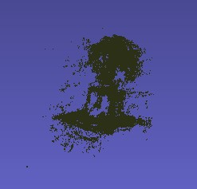
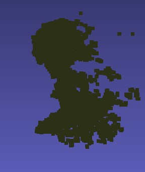
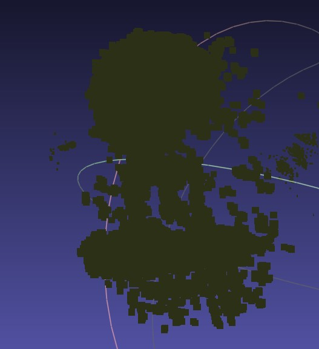

# Structure from Motion (SfM) Pipeline

This repository implements a **Structure from Motion (SfM)** pipeline to reconstruct 3D structures from a series of 2D images. The pipeline uses feature detection, camera pose estimation, triangulation, and bundle adjustment to generate accurate 3D reconstructions.

---

## Task 1: Structure from Motion (SfM)

### Pipeline Overview

1. **Image Acquisition**:
   - Input images (JPG/PNG format) are read, and their sizes are verified or resized as necessary.
   - The camera's intrinsic parameters, including focal length, are provided.

2. **Feature Detection and Matching**:
   - Detect SIFT features for each pair of images.
   - Match features and filter them using RANSAC to compute the **Fundamental Matrix (F)**.

3. **Camera Pose Estimation**:
   - Compute the **Essential Matrix (E)** from the Fundamental Matrix.
   - Estimate the camera pose for each image pair.

4. **Graph Creation and Triangulation**:
   - Create a graph structure to store camera poses and matched feature points.
   - Triangulate the points to estimate sparse 3D points.

5. **Bundle Adjustment**:
   - Refine camera poses and 3D points by minimizing reprojection errors.
   - Merge all triangulated graphs from image pairs into a single, consistent 3D structure.

6. **Dense Reconstruction**:
   - Perform dense matching between adjacent images to generate additional 3D points.
   - Create a dense 3D point cloud.

7. **Visualization**:
   - Visualize the final 3D reconstruction as a dense point cloud.

---

### Results

Below are examples of 3D reconstructions generated by the SfM pipeline:

- **Reconstruction 1**:
  

- **Reconstruction 2**:
  

- **Reconstruction 3**:
  

---

### Key Components and Algorithms

1. **Fundamental Matrix Estimation**:
   - Uses the **8-point algorithm** to calculate the fundamental matrix from matched feature points.

2. **Bundle Adjustment**:
   - Optimizes camera parameters and 3D points to minimize projection errors.

3. **Dense Matching**:
   - Generates a dense set of correspondences to refine the 3D structure.

---

## How to Use

1. **Clone the repository**:
   ```bash
   git clone https://github.com/your-repo/sfm-pipeline.git
   cd sfm-pipeline
